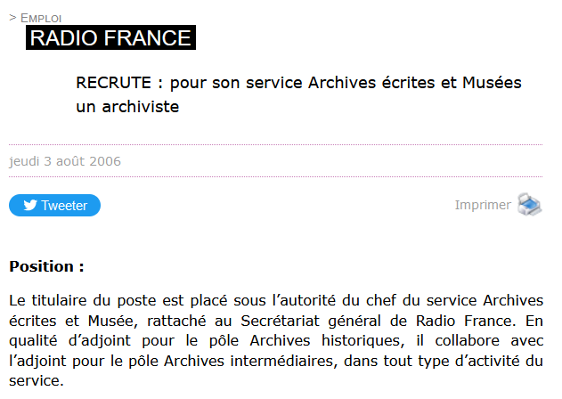

```{r setup, echo=FALSE, warning=FALSE, include=FALSE}
library(rmdformats)
library(dplyr)
library(tidyverse)
library(ggplot2)
library(plotly)
library(hrbrthemes)
library(RColorBrewer)
library(forcats)
library(leaflet)
library(lubridate)
library(GADMTools)
library(tm)
library(wordcloud)
library(stopwords)
library(SnowballC)
library(tidytext)
library(viridis)
library(readxl)
```


# D'où vient cette idée ?

## Genèse du projet

Ce projet est né d'une discussion avec Julien Benedetti, lors de laquelle nous avons partagé une impression : celle de voir le nombre d'offres d'emploi publiées sur le site internet croître de façon significative ces derniers mois (la discussion date de la fin d'année 2021).
Il s'agissait d'un ressenti, et j'ai eu l'idée de "compter" les offres sur le site de l'AAF pour vérifier cette intuition.

La première difficulté était de savoir pendant combien de temps étaient conservées les annonces sur le site de l'AAF, jusqu'à quand allais-je pourvoir remonter dans le temps ? Première satisfaction : les annonces ne sont jamais retirées du site, on les retrouve donc depuis que l'AAF les diffuse (2006-2007).

Il restait donc à les récupérer et à analyser le corpus ainsi constitué. Cela peut sembler assez anodin (un tableur et c'est parti !), mais, pour moi, il s'agissait aussi de mettre en pratique des compétences nouvelles (sur l'utilisation d'outils notamment) et d'en développer certaines liées à mon emploi actuel.

Le point de départ a donc été une question lors d'une simple discussion informelle et l'envie de tester une méthode et des outils. Mais, chemin faisant, les résultats se sont avérés très intéressants et j'ai choisi de communiquer et diffuser ces éléments.

Ce travail est un travail personnel, il comporte des lacunes et mériterait d'être approfondi et enrichi. 

## Organisation

Une méthodologie précise se trouve en seconde partie de ce notebook. 

La première partie du notebook comporte 3 analyses :

* Une analyse de la répartition des offres dans le temps
* Une analyse de la répartition géographique des offres
* Une analyse sémantique des offres

# Les analyses

## Analyse temporelle


Quelle est la répartition des annonces dans le temps ? Des annonces sont publiées sur le site de l'AAF depuis 2006. La première est une annonce publiée par Radio France en juin 2006.





```{r echo=FALSE}

# Ouverture du fichier qui comporte l'ensemble des annonces

data <- read.csv("EmploiAAF_final_geocode.csv", encoding = "UTF-8")

```

### Le nombre d'annonces par année

Le nombre d'annonces a connu une croissance générale, même si l'on peut remarquer certaines années de repli : 2009/2010, 2015 et 2020 du fait de la crise de la COVID19.

En 2021, 165 annonces ont été publiées sur le site de l'AAF.


```{r echo=FALSE}

# Réalisation du graphique représentant le nombre d'annonces par année

annee <- data %>%
  count(annee, name = "Nombre") %>%
  rename(
    Année = annee
  ) %>% 
  ggplot(aes(x=Année, y=Nombre)) +
  geom_area( fill="#0D0887FF", alpha=0.2) +
  geom_line(color="#0D0887FF", size=2) +
  geom_point(size=3, color="#0D0887FF") +
  labs(x="Année", y="Nombre d'annonces",
       title = "Evolution du nombre d'annonces publiées par année") +
  theme_ipsum_rc() +
  theme(panel.background = element_rect(fill = "#f7f7f7", colour="#f7f7f7"),
        plot.title = element_text(hjust=1),
        plot.background = element_rect(fill = "#f9f9f9", colour="#f9f9f9"))

ggplotly(annee)
```


### Répartition des annonces par année et par type

La notion de "privé" ou "public" se rapporte à l'employeur et non à la forme du contrat proposé. L'analyse précise du type de contrat (durée, statut...) est très complexe et aurait nécessité d'éplucher chaque annonce.

Les employeurs publics sont les plus nombreux a publier des annonces sur le site de l'AAF.

```{r echo=FALSE}
repart <- data %>%
  group_by(annee) %>% 
  count(type, name = "NbType") %>%
  rename(
    Année = annee,
    Nombre = NbType,
    Type = type
  ) %>%
  ggplot(aes(fill=Type, y=Nombre, x=Année)) + 
  geom_col(position= "dodge") +
  scale_fill_manual(values = c("Privé" = "#E16462FF",
                                "Public" = "#0D0887FF")) +
  labs(x= "Année", y= "Nombre", fill = "Secteur d'emploi",
       title = "Répartition des annonces par secteur d'emploi \net par année") +
  theme_ipsum_rc() +
  theme(panel.background = element_rect(fill = "#f7f7f7", colour="#f7f7f7"),
        plot.title = element_text(hjust=1),
        plot.background = element_rect(fill = "#f9f9f9", colour="#f9f9f9"))

ggplotly(repart)
```

### Répartition des annonces par type de structure et par année

Le secteur public constitue une catégorie multiple et non homogène (on y retrouve les services centraux, les collectivités, les établissements publics...). Si l'on catégorise chaque structure, on peut observer que le nombre d'emplois proposés par les communes et les départementaux sont assez proches et que la part des entreprises est la plus importante sauf entre 2009 et 2011. 


```{r echo=FALSE}
type <- data %>%
  group_by(annee) %>% 
  count(type_employ, name = "NbType") %>% 
  rename(
    Année = annee,
    Nombre = NbType,
    Employeur = type_employ
  ) %>% 
  ggplot(aes(fill=Employeur, y=Nombre, x=Année)) + 
  geom_bar(position="stack", stat="identity") +
  scale_fill_viridis(discrete = TRUE, option = "C") +
  labs(x= "Année", y= "Nombre", fill = "Secteur d'emploi",
       title = "Répartition des annonces par type de structure \net par année") +
  theme_ipsum_rc() +
  theme(panel.background = element_rect(fill = "#f7f7f7", colour="#f7f7f7"),
        plot.title = element_text(hjust=1),
        plot.background = element_rect(fill = "#f9f9f9", colour="#f9f9f9"))

ggplotly(type)
```


Le second graphique fait apparaître nettement la part du nombre d'offres proposées par les entreprises et leur progression dans le temps.


```{r echo=FALSE}
data <- read.csv("EmploiAAF_final_geocode.csv", encoding = "UTF-8")

```

```{r echo=FALSE}
entite <- data %>% 
  count(type_employ, annee, name = "nbre")
```

```{r echo=FALSE}
entite <- as.data.frame(entite)
```


```{r echo=FALSE}
ajout <- data.frame(c("CDG", "Conseil régional", "EPCI", "État et service déconcentré", "Secteur hospitalier", "État et service déconcentré", "Conseil régional", "Secteur hospitalier", "Secteur hospitalier", "Secteur hospitalier", "Conseil régional", "Secteur hospitalier", "Secteur hospitalier", "Conseil régional", "Secteur hospitalier"),
                    c(2006, 2006, 2006, 2006, 2006, 2009, 2010, 2010, 2013, 2014, 2017, 2017, 2018, 2019, 2020),
                    c(0, 0, 0, 0, 0, 0, 0, 0, 0, 0, 0, 0, 0, 0, 0))
```

```{r echo=FALSE}
names(ajout) <- c("type_employ", "annee", "nbre")
```

```{r echo=FALSE}
entite <- rbind(entite, ajout)
```

```{r echo=FALSE}
entite <- entite %>% 
 rename(
    Année = annee,
    Nombre = nbre,
    Employeur = type_employ
  )
```


```{r echo=FALSE}
heatmap <- entite %>% 
  ggplot(aes(Année, Employeur, fill = Nombre)) +
  geom_tile() +
  scale_fill_gradient(low="#F1F8F7", high="#0D088F") +
  labs(x = "Année", y = "Type d'employeur",
       title = "Nombre d'annonces par type d'employeur \n et par année") +
  guides(fill = guide_colourbar(title = "Nombre \nd'annonces")) +
  theme_ipsum_rc() +
  theme(panel.background = element_rect(fill = "#f7f7f7", colour="#f7f7f7"),
        plot.title = element_text(hjust=1),
        plot.background = element_rect(fill = "#f9f9f9", colour="#f9f9f9"))
  

ggplotly(heatmap)

```


### Classement des 20 annonceurs principaux

Durant cette quinzaine d'années, quels ont été les plus gros recruteurs ? Le premier sur le podium est le Département de Seine-et-Marne avec 25 annonces, suivi par l'entreprise X-Démat et une vingtaine d'annonces, enfin, le Département de l'Hérault complète de podium.

On peut également remarquer que les structures ayant publié 10 annonces sont nombreuses.

```{r echo=FALSE}

# Comptage et sélection des 25 plus gros annonceurs

annonceurs <- data %>%
  count(employeur, name ="Nb") %>% 
  arrange(desc(Nb)) %>% 
  head(20)

```


```{r echo=FALSE}


annonceurs %>%   
   mutate(employeur=fct_reorder(employeur,Nb)) %>%
    ggplot( aes(x=employeur, y=Nb)) +
    geom_segment( aes(xend=employeur, yend=0)) +
    geom_point( size=4, color="#0D088F") +
    coord_flip() +
    xlab("")+
    ylab("Nombre d'annonces") +
    ggtitle("Les 20 plus gros \n annonceurs") +
    theme_ipsum()  +
    theme(panel.background = element_rect(fill = "#f7f7f7", colour="#f7f7f7"),
        plot.title = element_text(hjust=1),
        plot.background = element_rect(fill = "#f9f9f9", colour="#f9f9f9"))

```


## Analyse géographique

### Part des annonces en France et à l'étranger

C'est peu étonnant mais la part des annonces localisées en France est très largement majoritaire. Les offres en dehors de la France se trouvent essentiellement sur le territoire européen. Il y a quelques annonces en Afrique (Ghana et un pays non mentionné mais indiqué "Afrique subsaharienne") et au Canada.

```{r echo=FALSE}

col <- c("#0D0887FF", "#E16462FF")

reppays <- data %>% 
  mutate(pays2=recode(pays, "Etranger" = "Autre pays", 'Afrique Subsaharienne' = "Autre pays", "Luxembourg" = "Autre pays", "Suisse" = "Autre pays", "Allemagne" = "Autre pays", "Belgique" = "Autre pays", "Canada" = "Autre pays", "Ghana" = "Autre pays", "Grèce" = "Autre pays", "Italie" = "Autre pays", "Royaume-Uni" = "Autre pays" )) %>% 
  count(pays2) %>% 
  mutate(percentage = round(n/sum(n),4)*100,
         lab.pos = cumsum(percentage)-.5*percentage) %>% 
  plot_ly(labels = ~pays2, values=~percentage, marker = list(colors = col)) %>% 
  add_pie(hole = 0.6) %>%
  layout(title = "Pourcentage des pays dans les annonces (hors France)",  showlegend = T, 
         xaxis = list(showgrid = F, zeroline = F, showticklabels = F),
         yaxis = list(showgrid = F, zeroline = F, showticklabels = F)
  )

reppays
  
```


### Pourcentage d'annonces par pays (hors France)

Il y a 29 annonces hors France, et, les deux pays où se trouvent les plus représentés sont : le Luxembourg (9 annonces) et la Suisse (8 annonces).

```{r echo=FALSE}

pays <- data %>% 
  mutate(pays2=recode(pays, 'Etranger'='Autre', 'Afrique Subsaharienne' = 'Autre')) %>% 
  count(pays2) %>% 
  filter(pays2 != "France") %>% 
  mutate(percentage = round(n/sum(n),4)*100,
         lab.pos = cumsum(percentage)-.5*percentage) %>% 
  plot_ly(labels = ~pays2, values=~percentage, marker = list(colors = viridis_pal(option = "C")(10))) %>% 
  add_pie(hole = 0.6) %>%
  layout(title = "Pourcentage des pays dans les annonces (hors France)",  showlegend = T, 
         xaxis = list(showgrid = F, zeroline = F, showticklabels = F),
         yaxis = list(showgrid = F, zeroline = F, showticklabels = F)
  )

pays
  
```

### Carte des annonces publiées

Sur cette carte sont localisées les différentes annonces, à l'exception de celles qui ne disposaient pas d'une localisation à la commune (ou dont la commune ne pouvait être déduite).

**Avertissement** : dans certains cas, la commune n'était pas indiquée mais à pu être déduite (par la localisation d'une entreprise ou d'une entité administrative). Cependant, il peut exister des biais ou des erreurs, le poste proposé n'étant pas nécessairement localisé au siège de la société ou de l'administration.


```{r echo=FALSE}

map <- read.csv("EmploiAAF_final_geocode.csv", encoding = "UTF-8") %>% 
      filter(commune != "NA")

```

```{r echo=FALSE}
infobox <- paste (sep = "<br/>",
                          "<b>Nom employeur : </b>", map$employeur,
                          "<b>Intitulé du poste : </b>", map$intitule_or)
```


```{r echo=FALSE}
leaflet() %>% 
  addTiles() %>% 
  addCircleMarkers(lng=map$long, lat=map$lat,popup = infobox, clusterOptions = markerClusterOptions()
  )

```

### Carte de la répartition par département

Pour les annonces localisées en France, quels sont les départements où il y a eu le plus d'offres diffusées (toutes structures confondues) ?

On peut remarquer que, pour quelques départements, il n'y a jamais eu d'offres diffusées sur le site de l'AAF.

**Avertissement** : dans certains cas, le département n'était pas indiqué mais à pu être déduit (par localisation d'une entreprise ou d'une entité administrative). Cependant, il peut exister des biais ou des erreurs, le poste proposé n'étant pas nécessairement localisé au siège de la société ou de l'administration.


```{r echo=FALSE}
france <- gadm_sf_loadCountries("FRA", level=2)
```

```{r echo=FALSE}
donnees <- read.csv("EmploiAAF_final_geocode.csv", encoding = "UTF-8")
```

```{r echo=FALSE}
donnees <- donnees %>% 
  group_by(departement) %>% 
  filter(departement != "NA") %>% 
  count(departement, name = "Nbdep")
  
```

```{r echo=FALSE}
donnees <- as.data.frame(donnees)
```

```{r echo=FALSE}
choropleth(france, 
           data = donnees,
           value = "Nbdep", 
           breaks = c(0,5,10,15,20,25,30,35,Inf),
           adm.join = "departement",
           labels = c("de 0 à 5", "de 6 à 10", "de 11 à 15", "de 16 à 20", "de 19 à 25", "de 26 à 30", "de 31 à 35", "supérieur à 35"),
           palette = "BuPu",
           legend="Nombre d'annonces",
           title="Carte du nombre d'annonces par département")
```


## Analyse sémantique

L'analyse de mots porte sur les intitulés des annonces.

### Nuage de mots

Sans grande surprise, le terme le plus présent dans les annonces est *archiviste*.


```{r echo=FALSE, warning=FALSE}
nuage <- readLines("nuage.txt", encoding = "UTF-8")
```

```{r echo=FALSE, warning=FALSE}
text_corpus <- Corpus(VectorSource(nuage))
text_corpus <- tm_map(text_corpus, content_transformer(tolower))
```

```{r echo=FALSE, warning=FALSE}
text_corpus <- tm_map(text_corpus, removePunctuation)
```

```{r echo=FALSE, warning=FALSE}
text_corpus <- tm_map(text_corpus,removeWords,stopwords("french"))
```

```{r echo=FALSE}
dtm <- TermDocumentMatrix(text_corpus)
m <- as.matrix(dtm)
v <- sort(rowSums(m),decreasing=TRUE)
d <- data.frame(word = names(v),freq=v)
```


```{r echo=FALSE}
set.seed(1234)
par(bg="#E16462FF")
wordcloud(words = d$word, freq = d$freq, min.freq = 1,
          max.words=100, random.order=FALSE, rot.per=0.1, 
          colors=brewer.pal(8, "Purples"))
```

### Répartition temporelle des mots les plus présents dans les annonces

Si l'on se concentre sur l'évolution des 5 mots les plus représentés, on peut remarquer que le terme *archiviste* connaît une croissance quasi ininterrompu depuis 2006. La progression est moins importante mais le terme *chargé* connaît également une hausse constante.

En revanche, un terme comme *conservation* est relativement stable. Il faut noter que ce terme apparaît dans de nombreux intitulé statutaire (assistant de conservation, attaché de conservation) qui peuvent figurer dans les intitulés des offres.

```{r echo=FALSE}
intitule <- read_xls(path = "intitule.xls")
```


```{r echo=FALSE}
mots_vides <- tibble(mots = c("h", "f", stopwords('fr')))

```

```{r echo=FALSE}
text <- intitule %>%
  unnest_tokens(mots, mots)%>% 
  anti_join(mots_vides, intitule, by="mots")

```


```{r echo=FALSE}
text2 <- text %>%
  rename(Année = annee) %>% 
  group_by(Année) %>% 
  count(mots, name="Occurrence") %>% 
  filter(mots %in% c("archives", "responsable", "archiviste", "chargé", "conservation")) %>% 
  mutate(mots2=mots) 

terme <- text2 %>%
  ggplot( aes(x=Année, y=Occurrence)) +
    geom_point(color="#0D0887FF")+
    geom_line( data=text2 %>% dplyr::select(-mots), aes(group=mots2), color="grey", size=0.5, alpha=0.5) +
    geom_line( aes(color=name), color="#0D0887FF", size=1.2 )+
    theme_ipsum_rc() +
    theme(
      legend.position="none",
      plot.title = element_text(size=14),
      panel.grid = element_blank(),
      panel.background = element_rect(fill = "#f7f7f7", colour="#f7f7f7"),
      plot.background = element_rect(fill = "#f9f9f9", colour="#f9f9f9")) +
    ggtitle("Répartition temporelle des mots les plus récurrents") +
    ylab("Nombre d'occurrence")+
    xlab("Année") +
    facet_wrap(~mots)

ggplotly(terme)
```

### Conclusion

La question initiale était *Peut on évaluer le dynamisme de l’emploi des archvistes par les annonces difusées sur le site de l’AAF ?*, peut-on y apporter une réponse définitive avec ces données ?

Les éléments tirés des annonces de l'AAF permettent de voir une croissance du nombre d'offres diffusées régulière et importante depuis 2015 (sauf en 2020, mais c'est lié au contexte sanitaire). On observe également une grande variété des acteurs mais un marché de l'emploi qui reste essentiellement localisée en France.

Il y a donc quelques premiers éléments permettant d'évaluer le dynamisme de l'emploi des archivistes mais cela demanderait d'être confirmé et croisé avec d'autres données.

# Méthodologie


### Outils

* Pour le scrapping de données : Data Miner

* Pour le nettoyage de fichier, l'enrichissement (réconciliation, géocodage) : Open Refine

* Pour les visualisations : R studio

### Création du corpus

Sur le site de l'Association des Archivistes Français (AAF) se trouve un onglet "Emploi" sur lequel sont référencées des offres d'emplois.

L'AAF offre 2 possibilités de diffusion des annonces :

* Les offres de stage et de CDD de moins d'un an sont diffusées gratuitement sur la liste de diffusion de l'AAF (réception par mail adressé aux membres de l'Association)

* La publication des offres de CDI, de postes statutaires et de CDD longs est payante mais la diffusion est plus large car elle est faite sur le site internet de l'AAF et elle est relayée sur les réseaux sociaux et également sur la liste de diffusion.

> Les offres d'emplois sont conservées trois mois en ligne, sauf demande de retrait de l’annonceur.

Les offres sont bien visibles durant 3 mois, mais, elles restent accessibles sur le site. C'est à partir de cette liste que le corpus de données d'annonces a été constitué.

Les données ont été scrappées depuis le site et organisées en une liste sous forme de tableur. La première version du tableur, issue de l'extraction, contenait 3 colonnes :

* L'employeur
* L'intitulé
* La date de diffusion sur le site

A l'extraction, le fichier comportait 1344 lignes.

### Nettoyage et enrichissement du corpus

#### Nettoyage des dates de publication

A l'extraction la colonne comportant la date de publication comportait l'indication "(Annonce publiée le JJ mois AAA)". Seule la date a été conservée et transformée au format JJ/MM/AAAA.

#### L'employeur

La colonne avec le nom de l'employeur a été nettoyée et, dans la mesure du possible harmonisée.

Exemples

* Les noms d'un même employeur ont été harmonisés.
* *Société A* et *A* ont été regroupés sous un même nom.
* Les "conseils généraux" ont été transformés en "conseils départementaux"
* Dans certains cas c'était le service d'archives qui apparaissait comme employeur et dans d'autres cas la collectivité. Le regoupement a été fait sous le nom de la collectivité.

### Nettoyage des intitulés

Les intitulés des offres comportaient un grand potentiel d'analyse sémantique. Mais, pour cela, il fallait les nettoyer de tous les éléments facilitants la lecture et la compréhension par des humains :

* Suppression du "recrute :" placé systématiquement en début d'intitulé.
* Suppression des éléments d'écriture inclusive et plus largement des éléments redondants comme H/F placés sur toutes les annonces
* Création un mot valise Earchiviste pour permettre le traitement du mot comme une entité à part entière

#### Multiplication des lignes

Parfois, une même annonce était passée pour plusieurs postes, dans ce cas, autant de lignes que de postes proposés ont été ajoutées au tableau.

#### Ajout d'éléments géographique

Le tableau initial a été enrichi de colonnes "Communes", "Département", "Pays". Dans les cas où la localisation était évidente (par l'employeur ou par l'intitulé), l'ajout a été fait automatiquement et, dans le cas où ce n'était pas évident, l'ajout a été manuel.

#### Ajout du type d'établissement

Cet élément a été ajouté, il propose de catégoriser les employeurs, les catégories utilisées sont :
* CDG
* Commune
* Conseil départemental
* Conseil régional
* Entreprise 
* EPCI
* Etablissement public
* État et service déconcentré
* Secteur hospitalier

#### Ajout du statut privé/public

Cet élément a été ajouté, il propose de catégoriser les types d'emplois :
* Public
* Privé

Cette catégorie porte sur le type d'employeur et non sur le type de contrat.

### Le corpus analysé

#### Dimension du corpus

Le corpus d'annonces se compose de 1377 annonces.
Il couvre une période qui va de juin 2006 (date de la première annonce disponible sur le site de l'AAF) à la dernière annonce publiée en 2021.

#### Limites du corpus

* Le corpus se limite aux annonces diffusées sur le site AAF, elles ne reflètent pas l'ensemble des emplois d'archivistes sur la période.

* Une partie des offres (les CDD, alternances, stages...) échappent à l'analyse car ces offres sont diffusés via la liste de diffusion de l'AAF.

* Pour permettre des analyses, les données ont été enrichies de certains éléments, néanmoins, ils catégorisent plus les employeurs que les emplois. La qualification fine des types d'emplois (statutaire ou non pour la fonction public, niveau de responsabilité ou catégorie d'emploi dans le statut de la fonction public, type de contrat CDI ou CDD long etc.) aurait supposé de dépouiller chaque offre de façon précise et aurait demandé trop de temps pour un travail personnel.

#### Perspectives

Cette analyse représente une première étape, elle esquisse quelques pistes de travail, mais elle pourrait être :

* Complétée avec d'autres données : par ex. celle du Collectif A8 (principalement pour l'historique) et du site [Profession archiviste](https://professionarchiviste-emplois-stages.com/)

* Replacée dans une étude plus large sur le rôle de l'AAF dans la professionnalisation, la reconnaissance et la valorisation des archivistes.  

* Ces éléments peuvent venir créer un observatoire de l'emploi qui pourrait être porté par l'AAF.

* Il faudrait compléter le travail par une analyse des CDD et contrat court proposé sur la liste de diffusion de l'AAF pour une vue plus large sur le sujet de l'emploi et de l'insertion professionnelle.
